# 🌐 Global IP Intelligence Platform

> A full-stack web application that enables innovators, law firms, and R&D teams to search, monitor, and analyze global intellectual property data through an intuitive dashboard.

---

## 📌 Project Overview

The **Global IP Intelligence Platform** is a full-stack web application that centralizes intellectual property information from multiple sources. It enables users to search patents and trademarks, monitor competitor filings, track legal status updates, and visualize IP trends through interactive dashboards. The platform provides secure role-based authentication and is designed with a scalable architecture for enterprise-level IP management.
> **Developed as a collaborative team project during the Infosys Springboard Virtual Internship 6.0**
---

## ❗ Problem Statement

Organizations often rely on multiple international databases to monitor patents and trademarks, making IP research time-consuming and inefficient. Tracking competitor filings, legal status updates, and IP trends requires switching between several platforms, reducing productivity and strategic visibility.

This platform addresses these challenges by providing a **centralized solution for global IP intelligence**.

---

## 🎯 Project Objectives
 
| | |
|---|---|
| 🏢 | Build a centralized IP intelligence platform |
| 🔍 | Provide advanced patent and trademark search |
| 🔐 | Implement secure JWT authentication |
| 🛡️ | Support role-based authorization |
| 📈 | Monitor competitor filings |
| ⚖️ | Track legal status updates |
| 🗺️ | Visualize IP lifecycle and trends |
| 🌍 | Integrate global IP data sources |
 
---
---
## ✨ Features

| Category | Features |
|----------|----------|
| 🔐 Authentication | User Registration, Login, JWT Authentication, Role-Based Access Control |
| 🔍 IP Search | Patent Search, Trademark Search, Competitor Filing Tracking, Legal Status Monitoring |
| 📊 Analytics | Interactive Dashboard, IP Landscape Visualization, API Health Monitoring |
| 👨‍💼 Administration | Admin Dashboard, User Management, System Logs |
| 📱 User Experience | Responsive UI, Intuitive Navigation |

---

## 🛠️ Tech Stack

| Category | Technologies |
|----------|--------------|
| **Frontend** | React.js, Tailwind CSS, JavaScript |
| **Backend** | Java, Spring Boot, Spring Security, Spring Data JPA |
| **Database** | PostgreSQL |
| **Authentication** | JWT Authentication, OAuth2 |
| **Build Tool** | Maven |
| **Version Control** | Git, GitHub |
| **API Testing** | Postman |
---
## 🎥 Demo

Watch the application in action:

▶️ **Project Demo:** [View Demo Video](https://drive.google.com/drive/folders/1I2w5xMvQ-hObvumSUKJ-T-UspiKCzUDN?usp=sharing)

▶️ **Project PPT:** [View Demo Video](https://onedrive.live.com/?redeem=aHR0cHM6Ly8xZHJ2Lm1zL2IvYy9mYzE4ZDZiNGY3NWIwNTc2L0lRQ2NjV1pvd1E3NVNwTU95bXE2RHhlX0FiZjRKSHUtLTUwd3o5UlNuOVh6Q0wwP1RlYW1zQ0lEPWUxY2I3NDQ0LTM2NWItNGU5OS1iNTViLTgzOTQ4MmU4OGQ2MCZsaW5rT3BlblRpbWU9MTc4NTQxMTk2MTIzNw&cid=FC18D6B4F75B0576&id=FC18D6B4F75B0576%21s6866719c0ec14af9930eca6aba0f17bf&parId=FC18D6B4F75B0576%21sc84cab6eaea34c2daf38153e0a06de20&o=OneUp)
---

## 🏗️ System Architecture

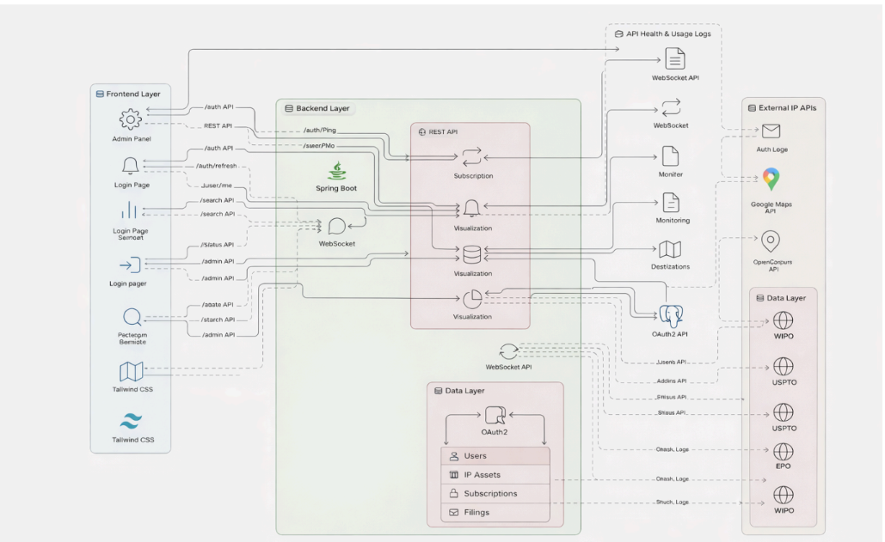

---

## 🧩 Modules

| Module | Description |
|--------|-------------|
| 🔐 **Authentication & Authorization** | Secure user registration, login, JWT-based authentication, and role-based access control for Users, Analysts, and Administrators. |
| 🔍 **Patent & Trademark Search** | Search intellectual property records using filters such as keywords, inventors, assignees, jurisdictions, and technology domains. |
| 📈 **Filing Tracker & Subscriptions** | Monitor competitor filings, subscribe to IP assets, and receive updates on changes in legal status. |
| 📊 **Dashboard & Analytics** | Visualize IP landscapes, filing trends, legal status, and other key insights through interactive dashboards. |
| 🛠️ **Admin Module** | Manage users, monitor API health, track system logs, and oversee platform administration. |

---

## 🖼️ Screenshots

### Landing & Authentication

| Landing Page | Login Page |
|---|---|
| 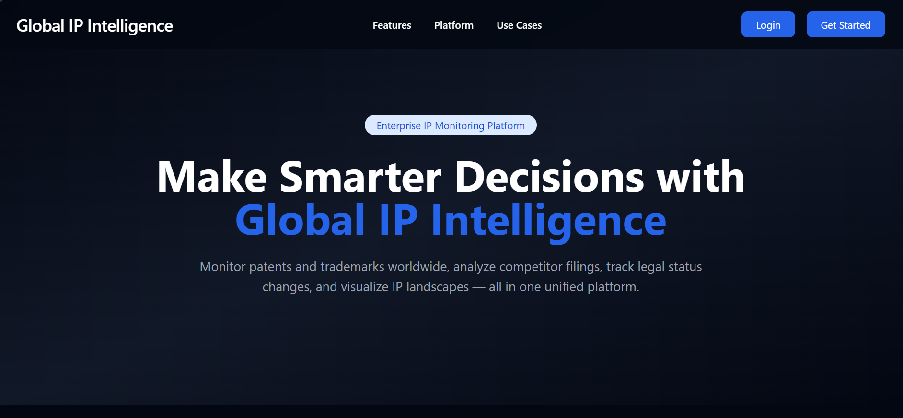 | 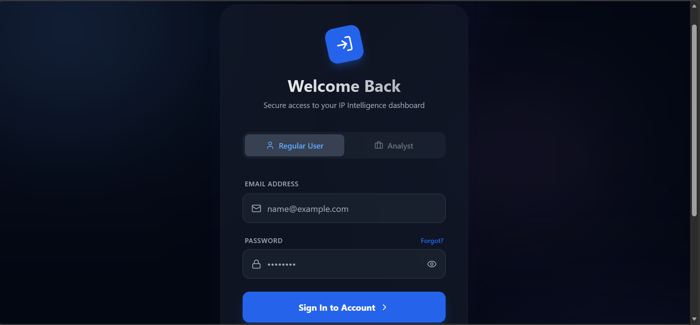 |

| Register Page | Analyst Registration |
|---|---|
| 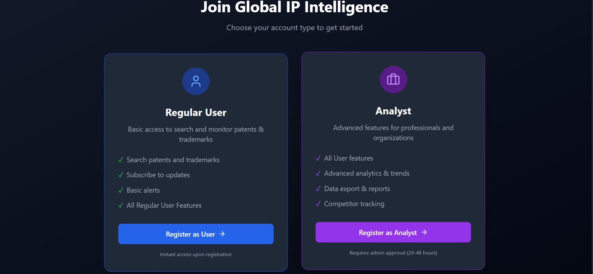 | 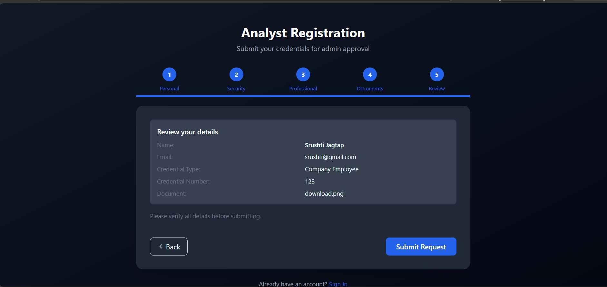 |

| Analyst Request to Admin | Profile Page |
|---|---|
| 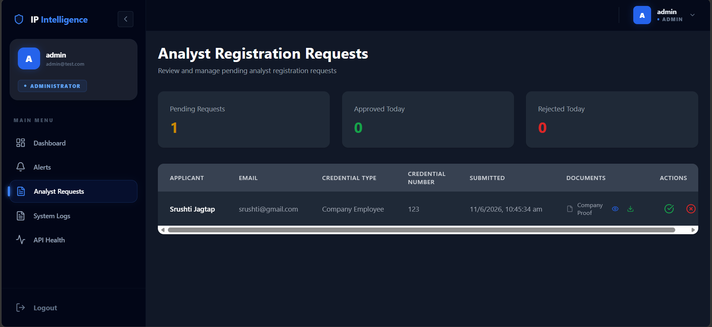 | 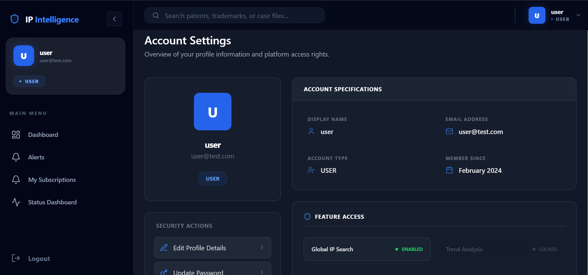 |

### Search & IP Details

| User Dashboard | User IP Search |
|---|---|
| 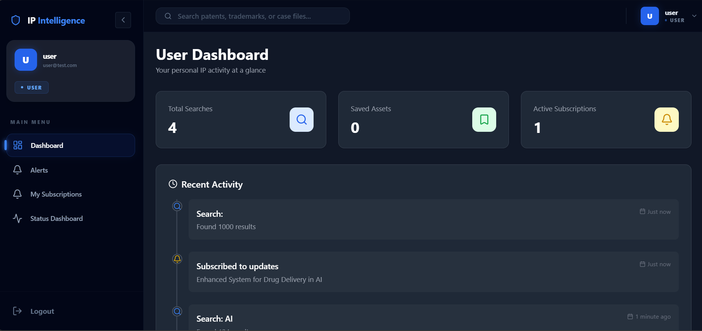 | 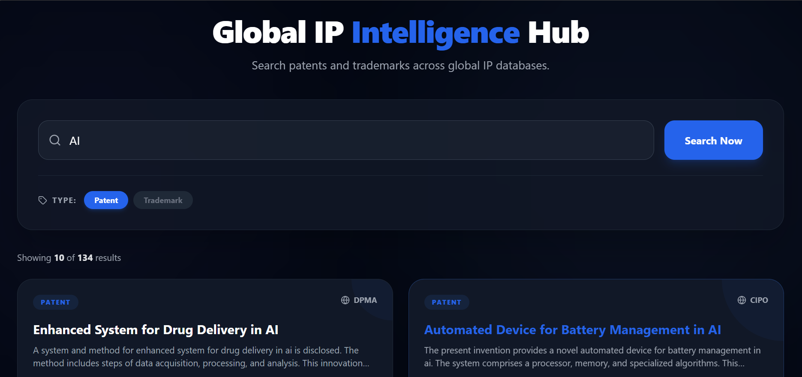 |

| Search Result | IP Detail |
|---|---|
| 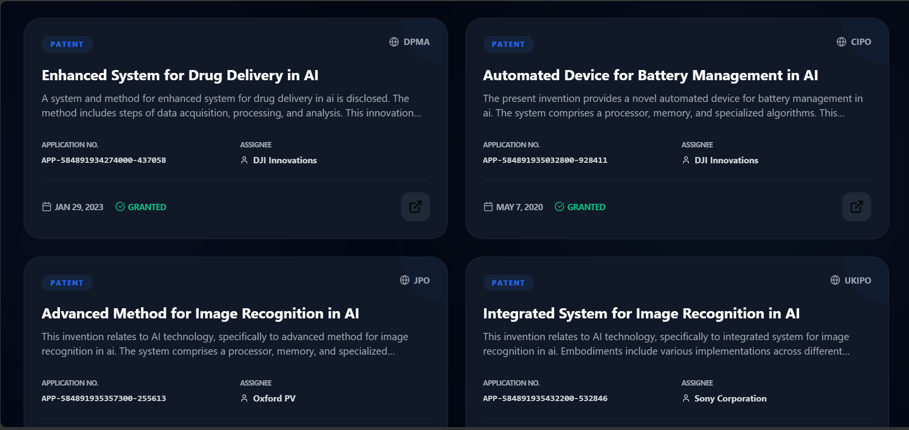 | 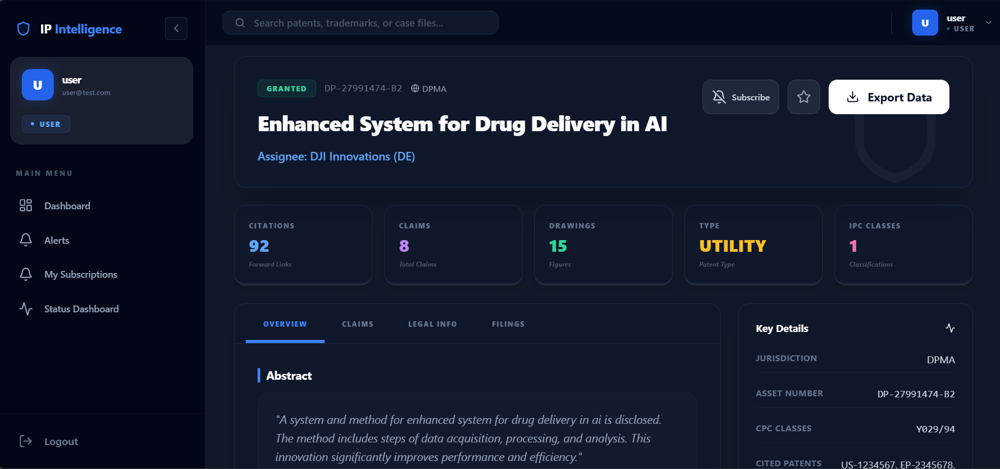 |

| IP Status Page | My Subscription Page |
|---|---|
| 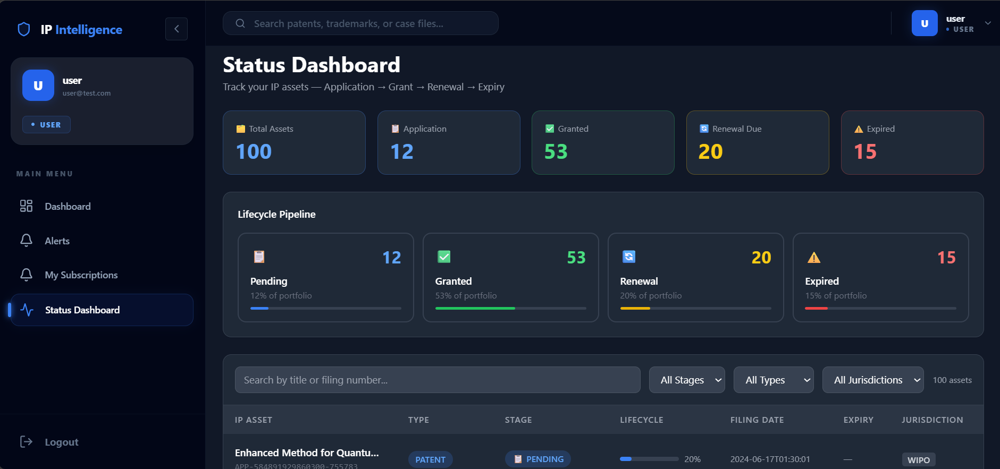 | 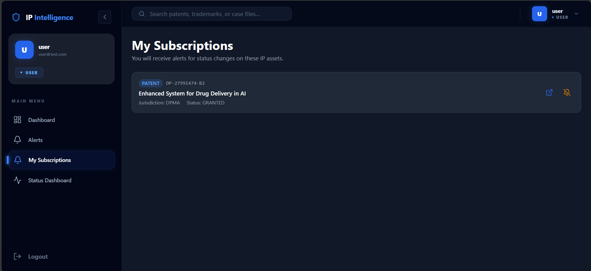 |

### Admin

| Admin Dashboard | Admin System Logs |
|---|---|
| 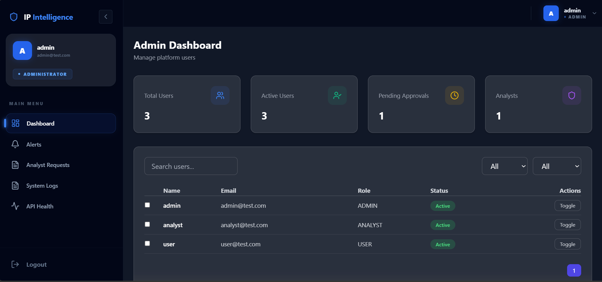 | 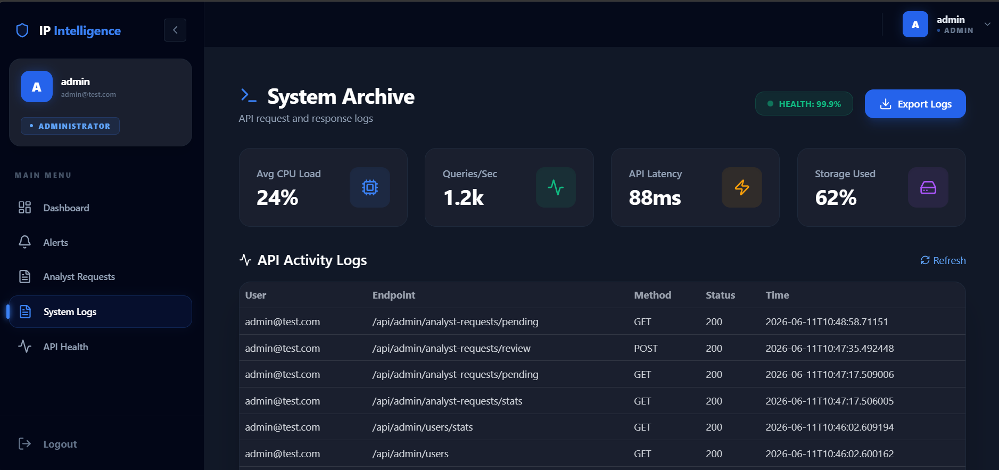 |

| Admin API Health Page | Admin API Monitoring |
|---|---|
| 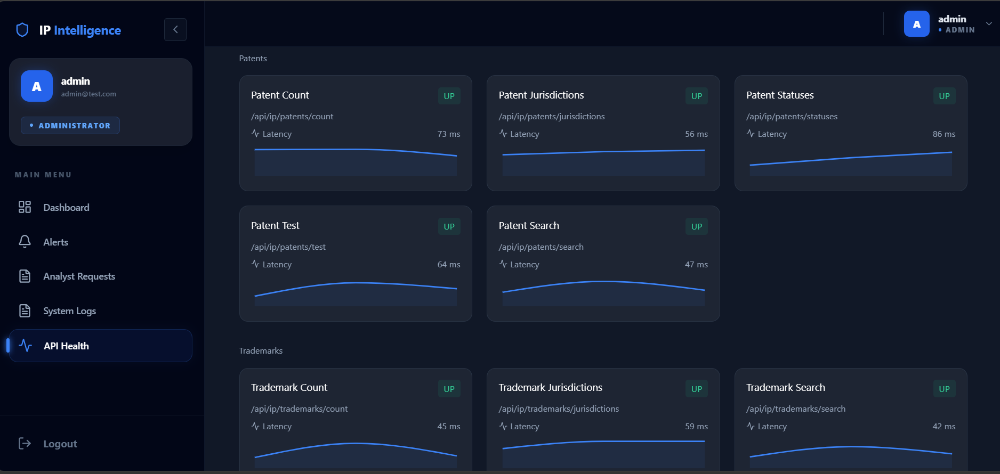 | 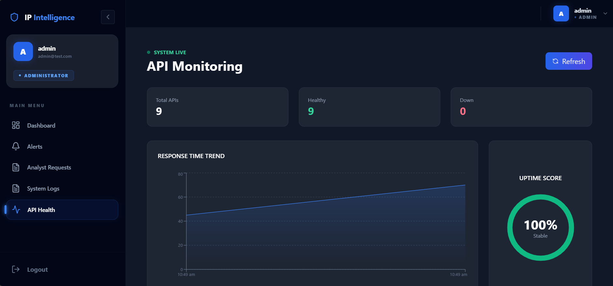 |

---

## 🔌 API Endpoints

### IP Search & Details

#### Patents

| Method | Endpoint | Description |
|--------|----------|-------------|
| `POST` | `/api/ip/patents/search` | Search patents with filters (pageable) |
| `GET` | `/api/ip/patents/{id}` | Get patent by internal ID |
| `GET` | `/api/ip/patents/number/{patentNumber}` | Get patent by official number (e.g. US-12345-B2) |
| `GET` | `/api/ip/patents/technologies` | List all technology categories |
| `GET` | `/api/ip/patents/jurisdictions` | List all jurisdictions |
| `GET` | `/api/ip/patents/statuses` | List all statuses |
| `GET` | `/api/ip/patents/count` | Total patent count |
| `GET` | `/api/ip/patents/count/jurisdiction/{jurisdiction}` | Count by jurisdiction |
| `GET` | `/api/ip/patents/count/status/{status}` | Count by status |
| `GET` | `/api/ip/patents/test` | Simple test endpoint |

#### Trademarks

| Method | Endpoint | Description |
|--------|----------|-------------|
| `POST` | `/api/ip/trademarks/search` | Search trademarks with filters |
| `GET` | `/api/ip/trademarks/{id}` | Get trademark by internal ID |
| `GET` | `/api/ip/trademarks/number/{trademarkNumber}` | Get trademark by registration number |
| `GET` | `/api/ip/trademarks/jurisdictions` | List all jurisdictions |
| `GET` | `/api/ip/trademarks/statuses` | List all statuses |
| `GET` | `/api/ip/trademarks/count` | Total trademark count |

### User Saved IP Assets ("My IP Assets")

| Method | Endpoint | Description |
|--------|----------|-------------|
| `GET` | `/api/ip/assets` | List current user's saved patents/trademarks |
| `POST` | `/api/ip/assets/save` | Save an asset (`{type: "PATENT"\|"TRADEMARK", assetId: number}`) |
| `DELETE` | `/api/ip/assets/save/{type}/{assetId}` | Remove a saved asset |
| `GET` | `/api/ip/assets/saved/{type}/{assetId}` | Check if asset is already saved |

---

## 🗄️ Database Design

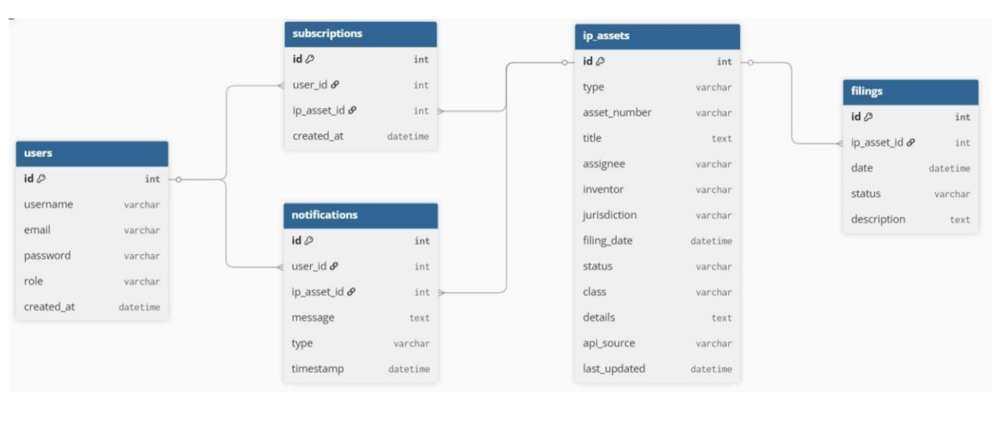

---

## 🔒 Security Features

- JWT Authentication
- Refresh Tokens
- Spring Security
- Password Encryption
- Role-Based Authorization

---

## 🎓 Learning Outcomes

Through this project, I gained experience in:

- Spring Boot REST APIs
- React.js
- JWT Authentication
- PostgreSQL
- API Integration
- Role-Based Authorization
- Full-Stack Development
- Git & GitHub

---

Developed during the <strong>Infosys Springboard Virtual Internship 6.0</strong> as a collaborative team project.

